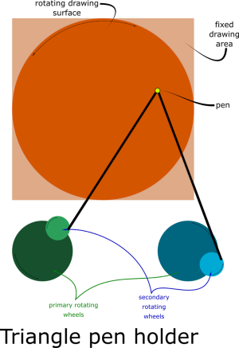
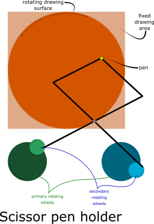
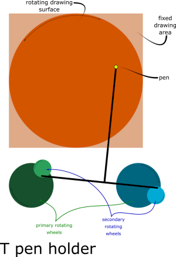

# whirliDoodle

WhirliDoodle is a [machine](README_physical-whirliDoodle-machine.md) (or [virtual machine](README_virtual-whirliDoodle.md)) that draws patterns determined by the spacial relationship between the pen holder arms and the rotating wheels. It essentially creates algorythmic art.

It is inspired by [Drawing Machine II](https://www.youtube.com/watch?v=BG9e06IWAxE) and [drawing machine maios 3](https://www.youtube.com/watch?v=rukYhTylK_M) (and others - see bottom for more links).

Eventually, this project will contain both the driver code for the physical machine and the code for a virtual machine to make testing various configurations much faster. For now, it contains the code for the virtual whirliDoodle machine (and currently even that isn't working due to me sucking at Maths and Trigonometry)

There are four basic parts to the (virtual) __whirliDoodle__ machine:
1. The pen holder (two arms connected to each other at the pen end and connected at the other end to a rotating wheel). The pen holder has three configurations:
   * Triangle
   * Scissor
   * T
2. Two rotating wheels, each of which form the origin of a side of the pen holder (__NOTE:__ each "rotating wheel" comprised of a primary wheen and an optional secondary wheel)
3. The drawing space (which may or may not also rotate, depending on configuration)

## Rough configuration of WhirliDoodle

## What I need help with

My current focus is getting the typescript version of the virtual WhirliDoodle machine working. (see [typescript/src/](typescript/src/))

In [`whirliDoodle.pureFunctions.ts`](typescript/src/whirliDoodle.pureFunctions.ts) there are four functions that need to be fixed:

`wheelRotator()` is partly working but it only rotates the radius point 180 degrees.

`trianglePenHolder()`, `scissorPenHolder()` & `TpenHolder()` not sure even where to start with these

In [`whirliDoodleMachine.ts`](typescript/src/whirliDoodleMachine.ts) the `draw()` method needs to be able calculate the bezier control points for the first two nodes.

The [MDN SVG tutorial](https://developer.mozilla.org/en-US/docs/Web/SVG/Tutorial/Paths#Curve_commands) has a bit of info

## Videos that inspired whirliDoodle

* [Drawing Machine II](https://www.youtube.com/watch?v=BG9e06IWAxE)
* [drawing machine maios 3](https://www.youtube.com/watch?v=rukYhTylK_M)
* [drawing machine maios 9](https://www.youtube.com/watch?v=akI78l1gXkU)
* [Maios 7 2a](https://www.youtube.com/watch?v=nnPEJYOR9nM)
* [kunstmaschine maios 5 ](https://www.youtube.com/watch?v=W5mE010nZKA)
* [Meccano guilloch&eacute; drawing machine](https://www.youtube.com/watch?v=Csf-62DfY48)
* [drawing machine ](https://www.youtube.com/watch?v=2DjvtjgRdGA)
*	[Master Guillocheur &ndash; M&eacute;tiers D'Art &ndash;  Vacheron Constantin](https://www.youtube.com/watch?v=gbQgvNlVf2c) (not quite the same thing but interesting and pssibly useful idea for working with porcelain)
